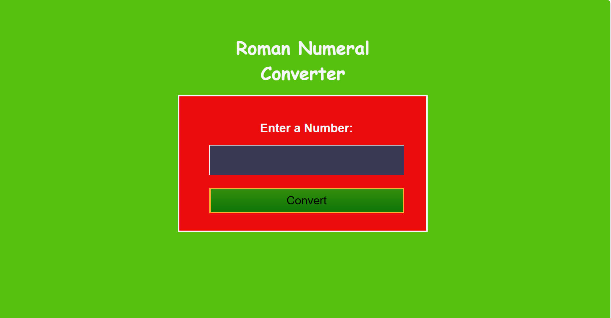

# -Roman-Numeral-Converter

## Project Description 📝

> Provide a detailed overview of your project. Explain what it does, why it is useful, and any other relevant information.

Examples;
Iwork index.html styles.css script.js


## Demo 📸

Include a demo or animated GIF of your project. You can use tools like [asciinema](https://asciinema.org/) to record your terminal sessions.



```html
<!DOCTYPE html>
<html lang="en">
  <head>
    <meta charset="UTF-8" />
    <meta name="viewport" content="width=device-width, initial-scale=1.0" />
   
    <link rel="stylesheet" type="text/css" href="styles.css" />
   
    <title>Roman Numeral Converter</title>
  </head>
  <body>
    <main>
      
      <h1>Roman Numeral Converter</h1>
      <form id="form" class="form">
        <fieldset>
          <label for="number">Enter a Number:</label><br />
          <input type="number" id="number" required />
          <button type="button" id="convert-btn">Convert</button>
        </fieldset>
      </form>
      <div id="output" class="output hidden"></div>
    </main>
    <script src="script.js"></script>
  </body>
</html>
```
```Css
* {
  padding: 0;
  margin: 0;
  box-sizing: border-box;
}

body {
  min-height: 100vh;
  padding: 50px 20px;
  font-family: 'Lato', Helvetica, Arial, sans-serif;
  font-size: 18px;
  background-color: #56c20f;
  color: #f5f6f7;
}

main {
  display: flex;
  flex-direction: column;
  align-items: center;
  justify-content: center;
}

h1 {
  text-align: center;
  margin: 20px auto;
  max-width: 350px;
  font-family: 'Castoro Titling', cursive;
}

form {
  color: #f5f6f7;
  margin: auto 25px;
  padding: 15px 0 0 15px;
  border: 3px solid #f5f6f7;
  text-align: center;
  width: 90%;
  max-width: 500px;
  background-color: #eb0d0d;
}

fieldset {
  border: 0 none;
  height: 100%;
  padding: 25px;
  margin: 10px 20px;
}

label {
  display: inline-block;
  font-size: 1.5rem;
  margin-bottom: 10px;
  font-weight: bold;
}

input {
  display: block;
  font-size: 2.5rem;
  width: 100%;
  height: 60px;
  padding: 6px 12px;
  margin: 10px 0;
  line-height: 1.4;
  color: white;
  background-color: #393954;
  border: 1px solid #f5f6f7;
}

button {
  cursor: pointer;
  margin-top: 15px;
  text-decoration: none;
  background-image: linear-gradient(#338e0c, #0e7508);
  border: 3px solid #feac32;
  padding: 10px 16px;
  font-size: 23px;
  width: 100%;
}

input:focus-visible,
button:focus-visible {
  outline: 3px solid #198eee;
}

.output {
  color: white;
  background-color: #f40f0f;
  border: 3px solid #f5f6f7;
  font-size: 2.5rem;
  width: 90%;
  max-width: 500px;
  min-height: 55px;
  margin-top: 25px;
  padding: 15px;
  overflow-wrap: break-word;
  text-align: center;
}

.alert {
  font-size: 2rem;
  background-color: #ffadad;
  border: 3px solid #850000;
  color: #850000;
}

.hidden {
  display: none;
}
```

```JS

const form = document.getElementById('form');
const convertButton = document.getElementById('convert-btn');
const output = document.getElementById('output');

const convertToRoman = (num) => {
  const ref = [
    ['M', 1000],
    ['CM', 900],
    ['D', 500],
    ['CD', 400],
    ['C', 100],
    ['XC', 90],
    ['L', 50],
    ['XL', 40],
    ['X', 10],
    ['IX', 9],
    ['V', 5],
    ['IV', 4],
    ['I', 1],
  ];
  const res = [];

  ref.forEach((arr) => {
    while (num >= arr[1]) {
      res.push(arr[0]);
      num -= arr[1];
    }
  });

  return res.join('');
};

const isValid = (str, int) => {
  let errText = '';

  if (!str || str.match(/[e.]/g)) {
    errText = 'Please enter a valid number.';
  } else if (int < 1) {
    errText = 'Please enter a number greater than or equal to 1.';
  } else if (int > 3999) {
    errText = 'Please enter a number less than or equal to 3999.';
  } else {
    // No errors detected
    return true;
  }

  // Handle error text and output styling
  output.innerText = errText;
  output.classList.add('alert');

  return false;
};

const clearOutput = () => {
  output.innerText = '';
  output.classList.remove('alert');
};

const updateUI = () => {
  const numStr = document.getElementById('number').value;
  const int = parseInt(numStr, 10);
  output.classList.remove('hidden');
  clearOutput();
  if (isValid(numStr, int)) {
    output.innerText = convertToRoman(int);
  }
};

form.addEventListener('submit', (e) => {
  e.preventDefault();
  updateUI();
});

convertButton.addEventListener('click', () => {
  updateUI();
});
```


## Technologies Used 🛠️

List the technologies or tools you used to develop your project. You can also include the libraries or frameworks you used.

Examples:

- HTML
- CSS
- JavaScript


## Installation 💻

Folow these steps to set up the project on your local machine Ensure you have the following software installed on your machine

``` git clone ```

https://github.com/fatiabdulahi/-Roman-Numeral-Converter/

## Usage 🎯

you can access to my project through git clone -git clone the HTTP or My SSH code link from the repository you wat to clone

``` git clone https://github.com/fatiabdulahi/-Roman-Numeral-Converter/```

## Features ⭐
-javascript
-github usage
Roman Numeral converter project


## Author 👩‍💻 FATIMA ABDULLAHI

Provide your name and a link to your Social Media profiles. You can also include your email address.


- LinkedIn:https://www.linkedin.com/in/fatima-abdullahi-6288662b2
- Email: fatima333abdullahi@gmail.com

## Contributing 🤝

Specify the license under which your project is distributed. Include any relevant copyright or attribution notices.
We welcome contributions from the community! Please follow the guidelines below to contribute to our project.
1: Fork the Repository: Click the "Fork" button at the top right of the repository page to create a copy of the repository on your GitHub account.
2: Clone Your Fork: Clone your forked repository to your local machine using the following command:git clone https://github.com/yourusername/yourprojectname.git
3: Create a Branch: Create a new branch for your work to ensure your changes are isolated from the main branch:git checkout -b feature-or-bugfix-description
4: Make Your Changes: Implement your changes, whether fixing a bug or adding a new feature. Be sure to follow the project's coding standards and guidelines.
5: Commit Your Changes: Commit your changes with a descriptive commit message:git add . git commit -m "Description of the changes"
6: Push to Your Fork: Push your changes to your forked repository:git push origin feature-or-bugfix-description
7: Submit a Pull Request: Go to the original repository and submit a pull request from your forked repository. Provide a clear and concise description of your changes and why they should be merged.

## License 📜
